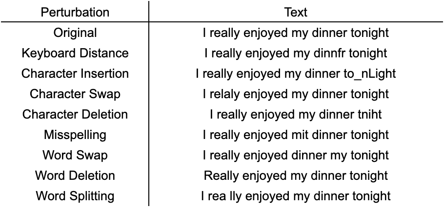
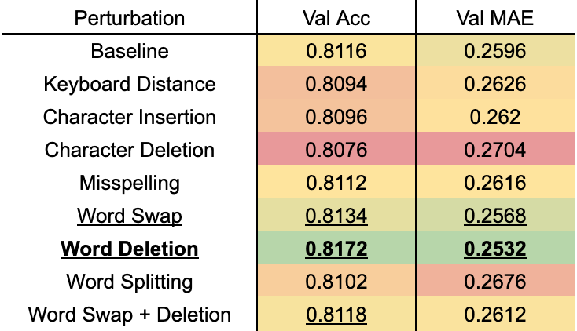

<h1 align="center">Predicting Rating From Review Text with BERT</h1>
<h3 align="center">Andy Sheu, Eric Yang, Fenglu Hong</h3>

---

  

### Problem Statement and Background

One of the biggest challenges of modern natural language processing lies in sentiment analysis. In particular, sentiment analysis is of particular interest to company marketing departments trying to collect customer feedback on their products in order to more accurately understand customer expectations and experiences, in addition to making more informed decisions.

One method is to simply provide heavily structured forms, where you categorically answer predefined questions by rating certain parts of your experience using 1 to 5 stars or by stating whether or not you agree with certain statements. The problem with this, of course, is that it severely limits the feedback given, and also doesn’t standardize scoring between different customers.

The other primary method to solicit customer feedback is to simply ask them about their experience in the form of text. Unfortunately, massive amounts of text isn’t numerical and thus needs to be processed in order to be used in aggregation, something which simply isn’t feasible for humans to do manually. As a result, companies care about sentiment analysis (and more specifically review to rating models) as a way to automate the feedback pipeline in order to speed up the feedback loop, eliminate bias between reviews (different labelers may interpret reviews differently), and hopefully reduce error. 

We are trying to do just that: predict a user’s rating of a restaurant on a 1-to-5 star scale (no half stars) given a text description of their experience. Our training data comes from a publically released Yelp dataset of 533,581 reviews (containing the text of their review and the rating they gave out of 5 stars). We will measure our model’s success by looking at its performance on unseen data in two metrics: predicting the exact rating and minimizing the mean absolute difference between the predicted and actual rating.

Early work in rating prediction centered around non-neural models, including Logistic Regression, SVMs, and Decision Trees/Random Forests. More recent research has shifted towards neural networks, highlighted by transformers, RNNs, LSTMs, and CNNs. One transformer in particular, BERT, has been incredibly effective and has established itself as the state of the art at a wide array of NLP tasks.

We explored several of those models and found that BERT was by far the best model according to both the accuracy and MAE metrics.

### Approach

  

Figure 1: Bag of Words Logistic Regression Model

For all of the models, we used only the Yelp dataset for training and validation. Our baseline model was 5-Class Logistic Regression with each review represented as a bag of words.

We experimented with LSTMs and Bidirectional LSTMs using both bag of words and GloVe embeddings. We also considered training an RNN but encountered issues in training and decided not to pursue it given that LSTMs are generally considered to be more effective.

  

Figure 2: BERT Preprocessing

  

Figure 3: Fine-Tuned BERT Sequence Classification Model

The final model we trained was a fine-tuned BERT classifier. We started with the Bert Sequence Classification transformer and tuned max sentence length and batch size (learning rate had a much smaller effect). Afterwards, we trained the model on a variety of data perturbations and a subset of the successful ones (word deletion on its own ended up being the most effective).

  

Figure 4: Data Augmentation Perturbations

### Results

We used only the Yelp dataset for training our models. For model comparison and hyperparameter tuning, we used 45,000 reviews for training, 5,000 reviews for validation, and 5,000 reviews for testing. We then took the best performing models according to test accuracy and test MAE (mean absolute error), trained them on the full 533,581 review Yelp dataset and tested them using the four release challenge datasets to see how well our models generalized to perturbed reviews (again using test accuracy and MAE to evaluate model success).

  

Figure 5: Model Comparison (45,000 training + 5,000 test)

BERT comfortably outperformed the LSTM-based and logistic regression-based models. Interestingly, logistic regression was surprisingly accurate (even beating out one of the LSTMs), although its absolute error was relatively high. This arises because our logistic regression model tended to over-predict 5 stars, which is by far the most frequently occurring class, allowing it to be frequently correct at the cost of being much more overly optimistic when predicting the wrong class (hence the high MAE).

As expected, the models using GloVe embeddings did better than the models using bags of words. More surprisingly, the bidirectional LSTMs weren’t really an improvement over the LSTMs, although this likely arose from a combination of random chance and insufficient hyperparameter tuning.

  

Figure 6: Perturbation Comparison on BERT (45,000 training + 5,000 test)

The baseline outperformed 5/7 perturbation models. Interestingly, all five of those models involved turning well-formed words into malformed words. This makes sense because it appears that BERT simply wasn’t able to embed those malformed words, given how infrequently each of those misspellings appear. The combined perturbation model, which either swapped or deleted words, wasn’t able to clearly beat the baseline. One possible reason is that the alternating swaps and deletions could be more difficult for BERT to learn and that one epoch of 45,000 training samples wasn’t enough. Additionally, the baseline model had a slight advantage in that the validation sets were not perturbed, meaning the baseline had the most similar training and test sets.

  

Figure 7: Test Results (533,581 training + 500 test per set)

We tested five of our models against the 4 released challenge datasets and the fine tuned BERT model with word deletion perturbations did the best. 

  

Figure 8: Final Model (BERT Delete Word) Training Loss

### Tools

We used a combination of Jupyter Notebooks and Google Colab (free GPU usage) to train our models. We wrote our neural models in PyTorch because we were familiar with it and PyTorch had all the libraries we needed to create our models. We used sklearn for our logistic regression model and bag of words vectorization, spacy for GloVe embeddings, and nlpaug for data augmentation because all three were simple to use and well-documented. We used huggingface’s transformers because it included BertForSequenceClassification, allowing us to easily fine-tune BERT to predict review ratings.

### Conclusion

Overall, the BERT fine tuned models were vastly superior to the other models. Data perturbations were successful if performed at a word level, rather than at a character level. We found that fine tuning BERT with word deletions gave us our best model.

### Team Contributions

Andy (60%) - BERT models, Embeddings, Data Augmentation, Graphics, Report

Eric (30%) - LSTM models

Fenglu (10%) - attempted RNN
